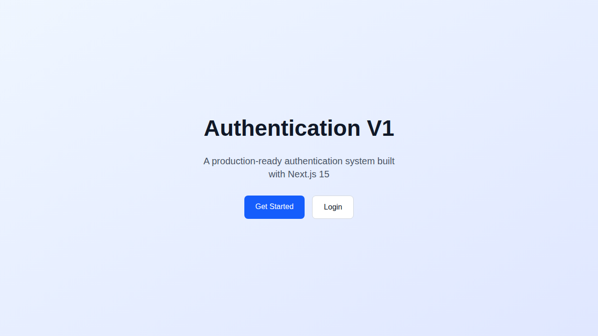
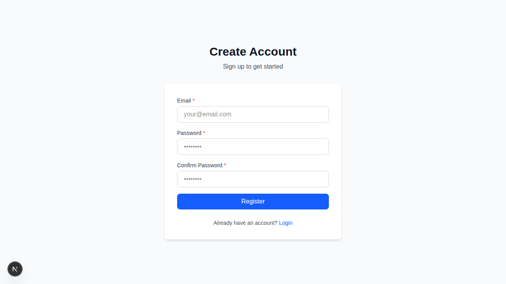
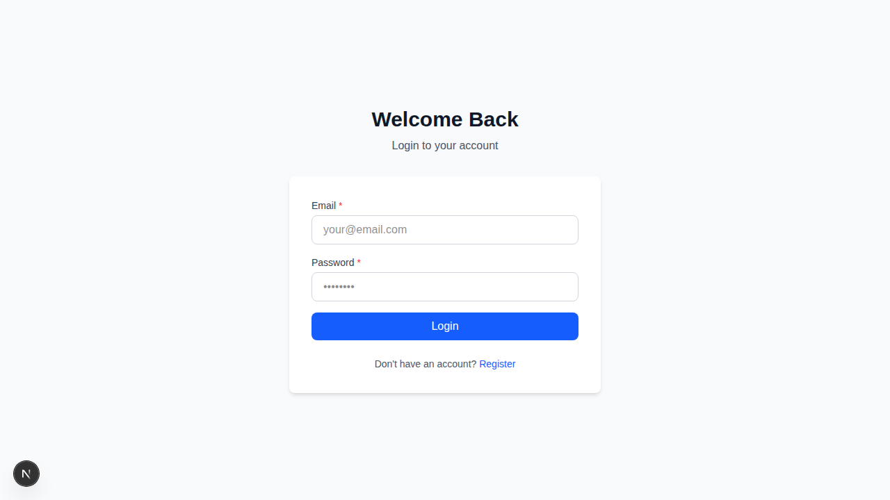

# Authentication V1

Production-ready authentication system built with Next.js 15 and TypeScript.

## Tech Stack

- **Next.js 15** - App Router with security headers
- **TypeScript** - Strict mode
- **React Hook Form** - Form handling
- **Zod** - Schema validation
- **React Hot Toast** - Toast notifications
- **Tailwind CSS** - Styling

## Features

- ✅ Register form (email, password, confirm password)
- ✅ Login form (email, password)
- ✅ Client-side validation with Zod
- ✅ Feature-based architecture
- ✅ Security headers & middleware
- ✅ Toast notifications for user feedback
- ✅ Responsive design
- ✅ TypeScript strict mode
- ✅ Production-ready UI
- ✅ Server Components by default
- ✅ Lockfile committed

## Project Structure

This project uses a **feature-based architecture** with shared UI components:

```
unique-auth-v1/
├── src/
│   ├── app/                  # Next.js App Router pages
│   │   ├── login/page.tsx
│   │   ├── register/page.tsx
│   │   ├── layout.tsx        # Root layout with ToastProvider
│   │   └── page.tsx
│   ├── features/             # Feature modules
│   │   └── auth/
│   │       ├── components/   # Feature-specific components
│   │       │   ├── LoginForm.tsx
│   │       │   └── RegisterForm.tsx
│   │       └── schemas/      # Feature-specific schemas
│   │           ├── loginSchema.ts
│   │           └── registerSchema.ts
│   ├── shared/               # Shared resources
│   │   └── ui/               # Reusable UI components
│   │       ├── Button.tsx
│   │       ├── Input.tsx
│   │       ├── Label.tsx
│   │       └── FormField.tsx
│   ├── lib/                  # Utilities & providers
│   │   └── providers/
│   │       └── ToastProvider.tsx
│   └── middleware.ts         # Security headers
```

**Architecture principles:**
- **Features** contain domain-specific logic (auth, user, etc.)
- **Shared/UI** contains reusable components used across features
- **Separation of concerns** between features and shared code
- **Scalable** structure for growing applications

## Getting Started

### Installation

```bash
npm install
```

### Development

```bash
npm run dev
```

Open [http://localhost:3000](http://localhost:3000)

### Build

```bash
npm run build
```

### Production

```bash
npm start
```

## Screenshots

### Home Page


### Register Page


### Login Page


## UNIQUE Standards

This project follows UNIQUE frontend standards:

- ✅ TypeScript strict mode enabled
- ✅ No comment lines in code
- ✅ Feature-based architecture
- ✅ Security headers & middleware
- ✅ Server Components by default, Client Components explicit
- ✅ Consistent folder structure
- ✅ Lockfile committed

## License

MIT
